# Lab3-Analizator_wynikow - Dokumentacja

## Opis działania
W trakcie działania tego workflow pobierany jest dataset na którym trenowane i oceniane są następnie niektóre z modeli uczenia maszynowego. Uruchamiany jest skrypt, który 
automatycznie dobiera najlepsze parametry do każdego modelu. Modele trenowane są przy pomocy walidacji krzyżowej. Oceniane są na podstawie takich metryk jak: MAPE, MAE, MSE, R2.

## Struktura repozytorium
- `main.py`: Skrypt wykonujący całość procesu uczenia maszynowego.
- `charts/`: Katalog zawierający wygenerowane histogramy i wykresy słupkowe.
- `log.txt`: Plik zawierający logi działania skryptu.
- `requirements.txt`: Plik wymagań do zainstalowania

## Przygotowanie i uruchomienie
### Wymagania wstępne
- Python >= 3.11
- pip 

### Instalacja pakietów
```bash
pip install -r requirements.txt
```

### Pobranie danych
```bash
curl -o CollegeDistance.csv https://vincentarelbundock.github.io/Rdatasets/csv/AER/CollegeDistance.csv
```

### Uruchomienie
```bash
python main.py CollegeDistance.csv models --n_folds 5 --seed 1337
```

## Eksploracja i analiza danych
### Wykresy
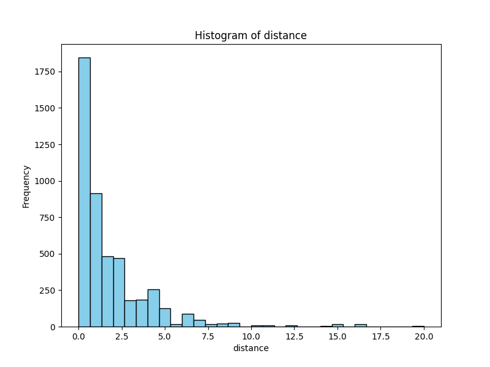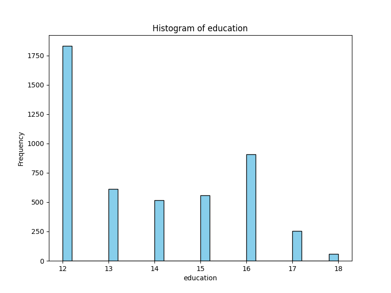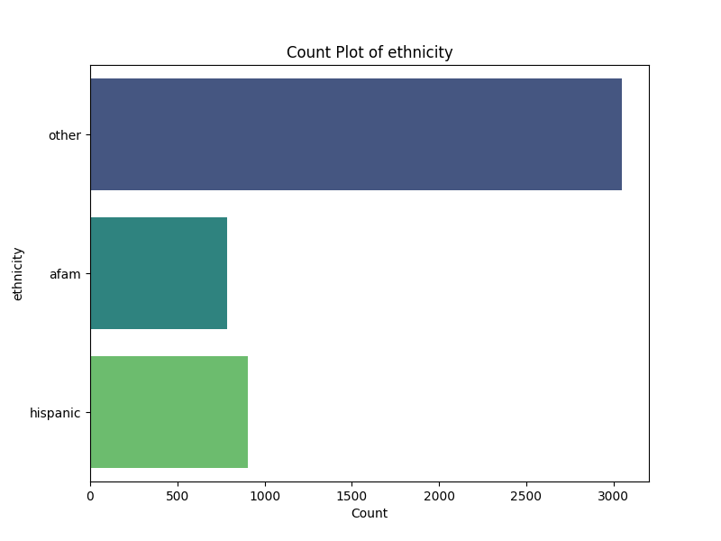
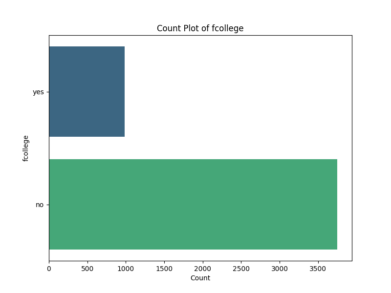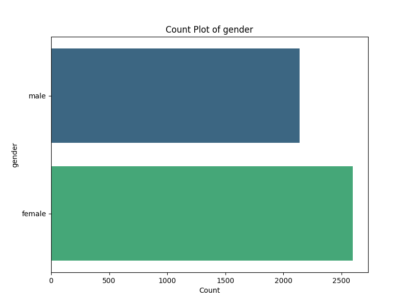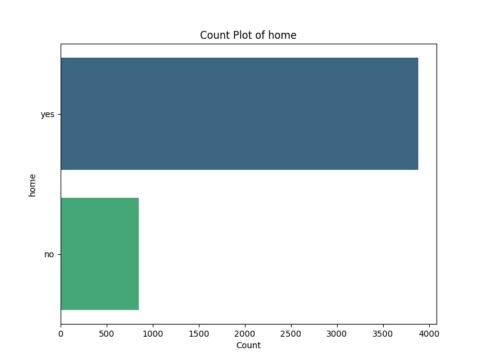
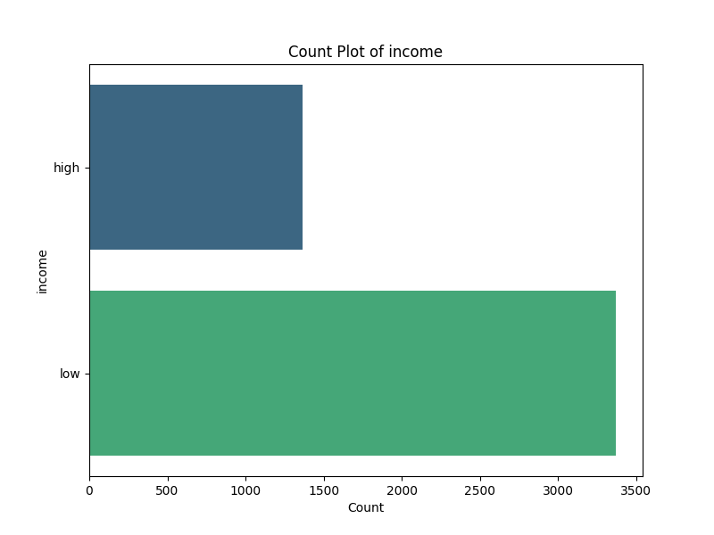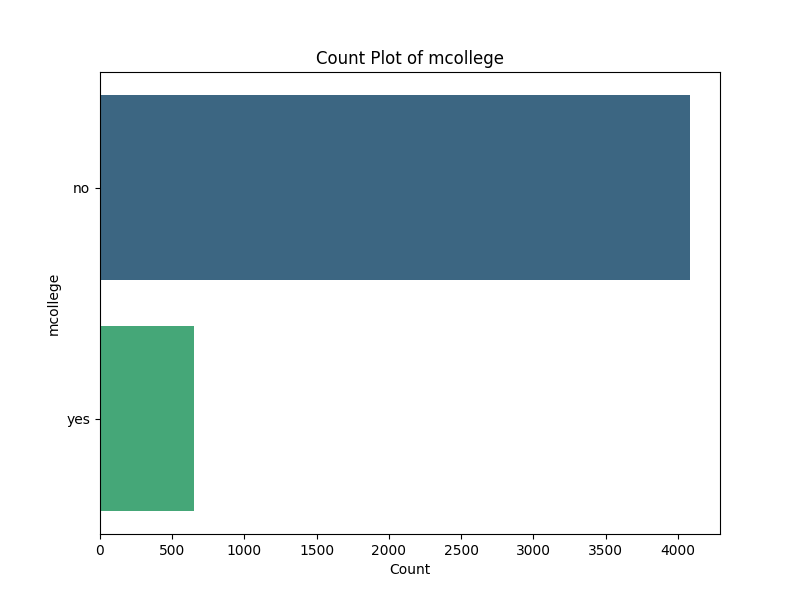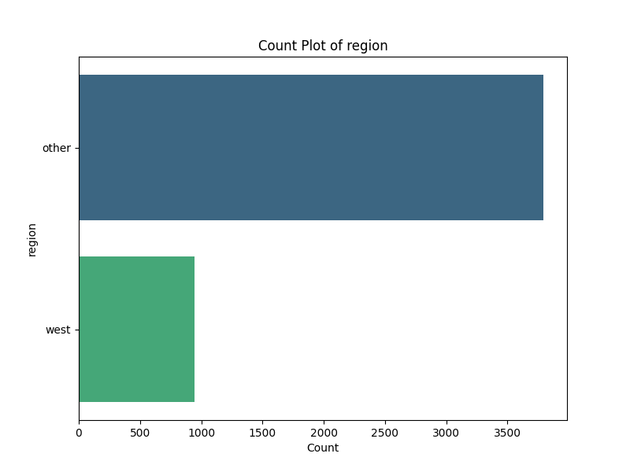
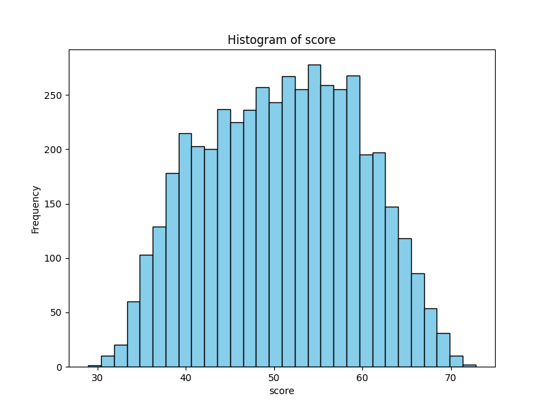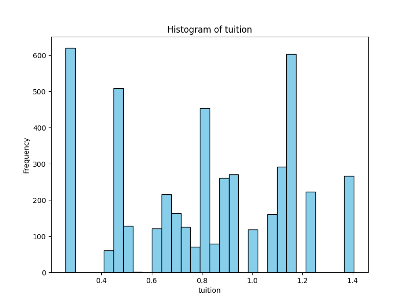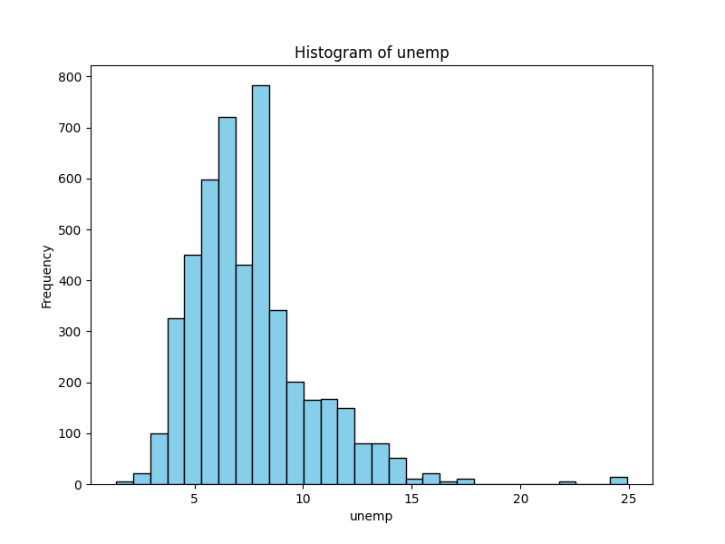
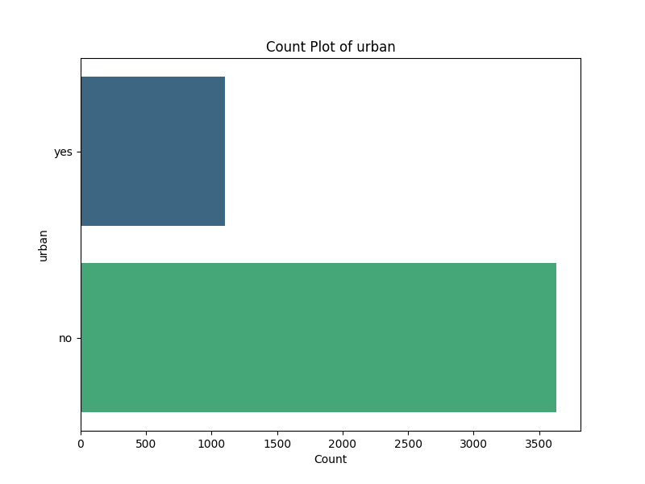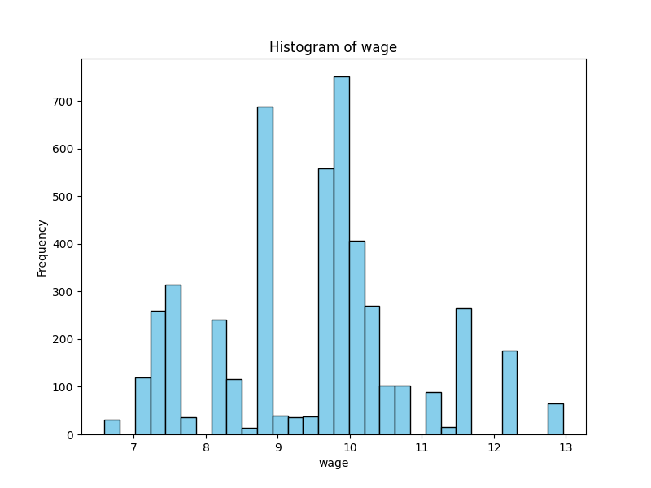
### Czyszczenie danych
Usunięto kolumnę "rownames" ponieważ był to tylko identifikator nie mający znaczenia dla predykcji
Brakujące wartości wypełniono za pomocą imputacji:
-średnią w przypadku kolumn numerycznych
-wartością "Unknown" w przypadku kolumn kategorialnych

## Inżynieria i przygotowanie danych
Przed podziałem na zbiór treningowy i testowy użyto RobustScaler dla kolumn numerycznych w celu zmiejszenia znaczenia wartości odstających i OneHotEncoder dla wartości kategorialnych
w celu lepszej interpretacji przez model uczenia maszynowego.

Zbiór został podzielony na podzbiory: treningowy (70%), walidacyjny (15%) i testowy (15%).


## Wyniki i podsumowanie
Modele były trenowane przy użyciu walidacji krzyżowej i następnie przetestowane na zbiorach walidacyjnym i testowm. W poniższej tabeli przedstawione są wyniki dla poszczególnych modeli.

### Wyniki
| Model              | Zbiór         | MAPE      | MAE        | MSE        | R²       |
|--------------------|---------------|-----------|------------|------------|----------|
| GradientBoosting   | Test          | 0.1232    | 5.9604 	  | 53.7745    | 0.3169   |
| GradientBoosting   | Train (CV)    | 0.1168    | 5.6855 	  | 49.6077    | 0.3323   |
| GradientBoosting   | Validation    | 0.1182    | 5.8289 	  | 50.9958    | 0.3552   |
| XGBoost            | Test          | 0.1230    | 5.9514 	  | 53.7570    | 0.3171   |
| XGBoost            | Train (CV)    | 0.1167    | 5.6810 	  | 49.5001    | 0.3338   |
| XGBoost            | Validation    | 0.1182    | 5.8250 	  | 50.9433    | 0.3558   |
| RandomForest       | Test          | 0.1204    | 5.8596 	  | 52.1318    | 0.3378   |
| RandomForest       | Train (CV)    | 0.1184 	 | 5.7682 	  | 51.0629    | 0.3128   |
| RandomForest       | Validation    | 0.1196 	 | 5.8920 	  | 52.8243    | 0.3320   |
| MLPRegressor       | Test          | 0.1257 	 | 6.0227 	  | 54.5180    | 0.3075   |
| MLPRegressor       | Train (CV)    | 0.1239 	 | 5.9878 	  | 54.8876    | 0.2613   |
| MLPRegressor       | Validation    | 0.1214 	 | 5.9105 	  | 52.6661    | 0.3340   |

### Wnioski

Najgorzej poradził sobie MLPRegressor uzyskując jedne z najwyższych wartości w metrykach błędu i jednakowo zaliczając najsłabszy wynik w R2.

Jeśli chodzi o zbiór testowy najlepiej poradził sobie RandomForest mając ok 0.030 miejszy błąd w MAPE, 0.1 mniejszy w MAE, 1 mniejszy w MSE i 0.2 lepsze dopasowanie do zbioru (R2)

Podsumowując, raczej odrzucilibyśmy model MLPRegressor a pozostałe 3 jako, że mają jednak zbliżone wyniki można by dalej porównywać dostosowywując hiperparametry.